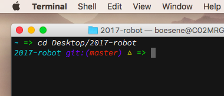

# erkbsn

[oh my zsh](https://github.com/robbyrussell/oh-my-zsh) theme heavily influenced by the default theme, `robbyrussell`.

I use Source Code Pro Light Italic 13pt with a `#111111` background, but you can use whatever you want.
